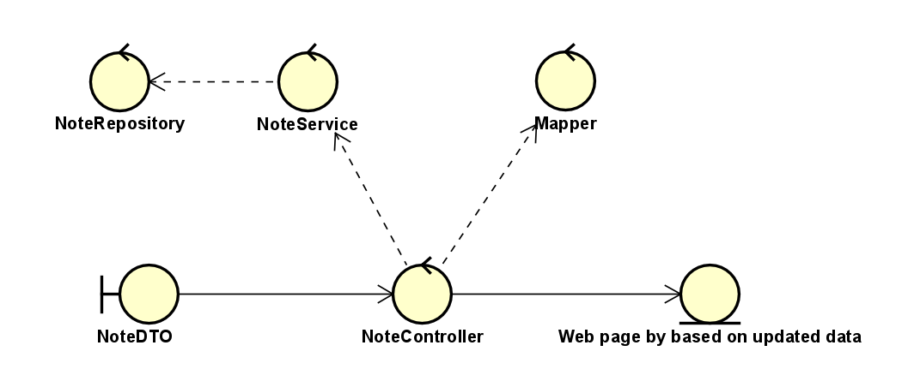

# Planning&Doing проект, реализованный в рамках курса "Объетно-ориентированный анализ и дизайн"
## Инструкция по сборке и запуску программы
### Из консоли
В открытой в консоли директории проекта прописать команды ниже
### Сборка 'jar' файла при помощи maven (требуется минимум java 17)
```
mvn install
```
### Готовый запуск
```
mvn spring-boot:run
```
### С помошью docker
```
docker-compose up --build
```
## API backend приложения 


## Архитектура приложения
### Дизайн модель

### Аналитическая модель
